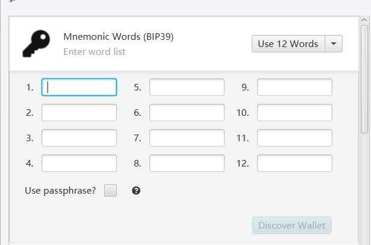
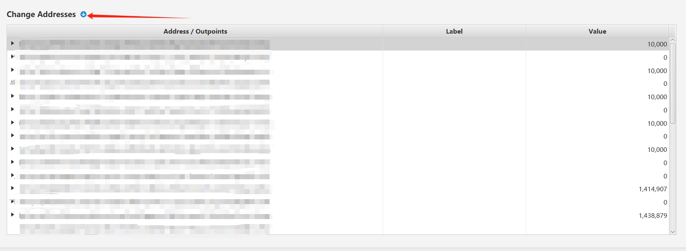
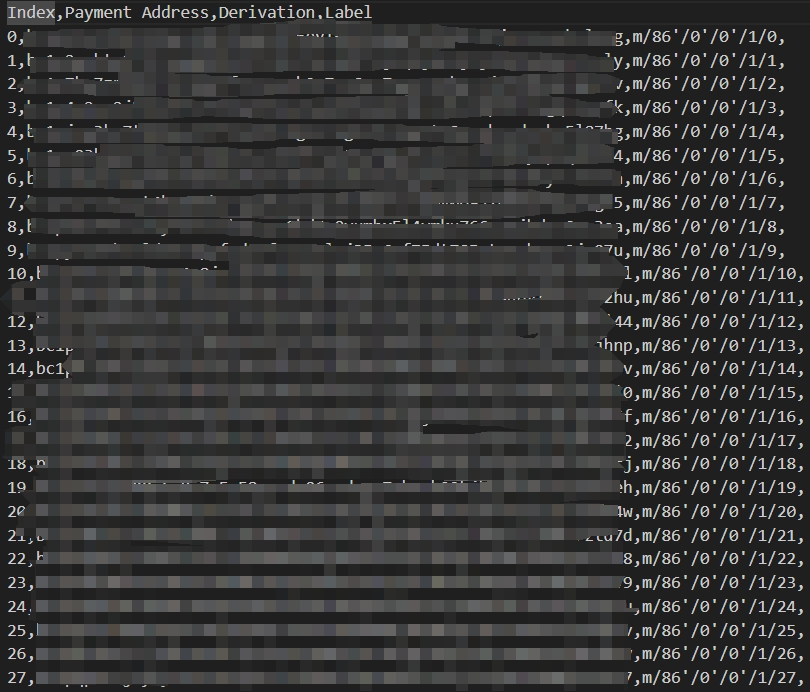

## Introduction
Bitcoin addresses can be confusing, especially when an address generated by one wallet appears completely different when imported into another wallet. For instance, an address generated by Rune (ord) might not show up when imported into another wallet. This issue arises due to different HD (Hierarchical Deterministic) path derivations from the same mnemonic phrase.
## Installation

```bash
pnpm i
```

## Finding Your Path

1. Download Sparrow Wallet.
2. Recover your wallet using your mnemonic phrase.

   

3. Navigate to the address menu to locate the specific address you wish to export. Make sure to remember this address.
4. Export all addresses available.

   

5. Determine the specific address path you need and update the `test.js` file accordingly.
   
## 介绍
比特币的地址令人迷惑，一个钱包生成的地址导入另外一个钱包后发现是完全不同的地址，比如打符文ord生成的地址导入钱包后发现没有，怎么办呢？羊帮你找回比特币钱包，其实这是因为比特币路径派生由一个助记词的不同HD_path派生不同。
## 安装

```bash
pnpm i
```

## 寻找您的路径

1. 下载 Sparrow 钱包。
2. 使用您的助记词恢复您的钱包。

   

3. 转到地址菜单以查找您想要导出的特定地址。确保记住这个地址。
4. 导出所有可用的地址。

   

5. 确定您需要的特定地址路径，并相应地更新 `test.js` 文件。

   

